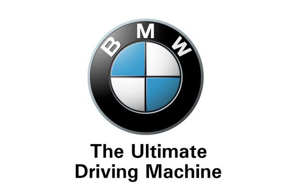

  

## react-BMW

This is the react renderer for BMW OAP apps that helps creating awesome UI with minimal effort.

The purpose of this project is to make development of the OAP easy and enjoyable using a consistent developer experience based on JavaScript and React. 

## Motivation

We found that the implementation of UI is a real challenge for newbies (maybe not only for newbies :) ). There are HMI, XML and JSON files that represent the same UI. We decided to try to make it easier with well known library - React. Thanks to that we are able to building user interfaces differently by breaking them into reusable components and generate needed files for OAP.

What are the advantages:
- The declarative nature of components promotes predictability
- By unifying your markup with its corresponding view logic, React can actually make views easier to extend and maintain.
- Reduces time spent on creating layouts by developers.
- Opens possibility to write apps in well known and documented library

